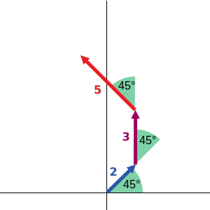

# The Beauty of Primes

## Overview

The Beauty of Primes is a prime number visualization app built with React and Canvas. You can check out the app [here](https://akgupta89.github.io/prime-visualizer/).

Prime numbers are intricately fascinating. They can only be divided evenly by the numbers 1 and themselves, they are infinite, no formula exists to completely and reasonably calculate them, and these numbers form the basis of modern cryptography. This app takes a list of primes and draws them in 2D space as vectors.



The prime number serves as the magnitude, and the angle delta provides a direction. By lining up the arrows from head to tail, beautiful patterns [start to emerge](https://akgupta89.github.io/prime-visualizer/).

## Installation

1. ```sh
   npm ci
   ```

2. ```sh
   npm run start
   ```

## How To Use

- Type in a number between 0 and 360 for the Angle Delta
- Change the Draw Route to see if you can find a pattern in the numbers

## Todos

- Generate primes on runtime, and support rendering a range of primes
- Abstract canvas into separate package
- Better pinch to zoom (hammer.js?)
- Log collected data in human readable format
- Write a tracing algorithm that works on mouse hover
- Optimize the app to cache one time generation information
- Sharing URLs via History API
- Bound the blip gradient radius dynamically
- Hovering over prime numbers display a tooltip